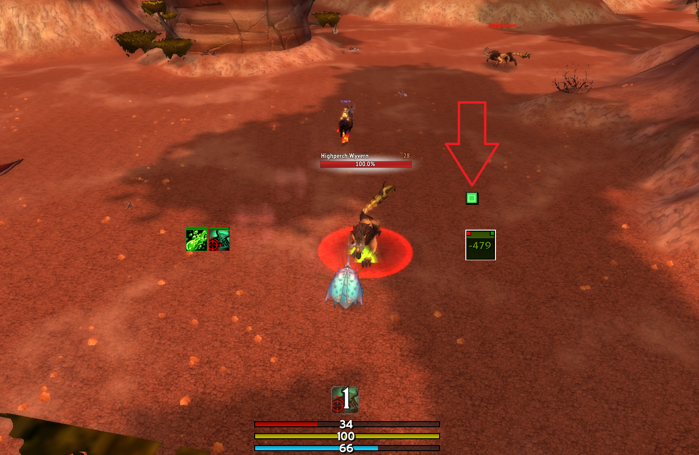
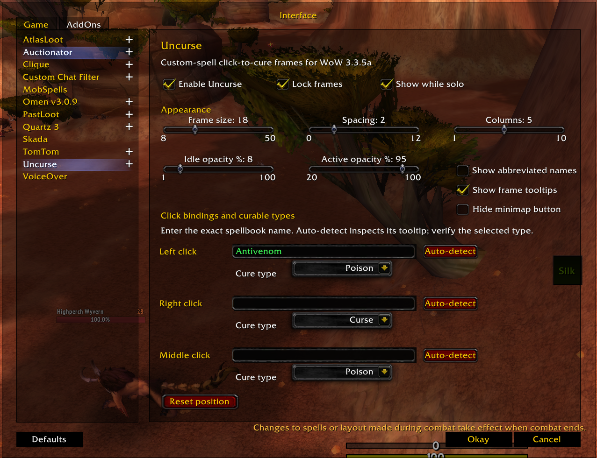

# Uncurse

Uncurse is a lightweight click-to-cure micro-frame addon for World of Warcraft
3.3.5a. It is designed for private/custom servers where cleansing spells may not
use standard spell IDs or names.

## Screenshot

### In-game indicator



### Settings menu



## Installation

1. Download the repository from GitHub and extract the ZIP.
2. Open the extracted repository folder.
3. Copy the inner `Uncurse` directory into:

`World of Warcraft\Interface\AddOns\`

The installed structure must be:

```text
Interface
└── AddOns
    └── Uncurse
        ├── Uncurse.toc
        ├── Uncurse.lua
        └── Options.lua
```

Do not copy the entire downloaded repository into `AddOns`; WoW needs the inner
folder named exactly `Uncurse`. Restart the client or type `/reload`.

## Setup

1. Open **Game Menu → Interface → AddOns → Uncurse**, click the minimap icon,
   or type `/uncurse`.
2. Enter cleansing spells exactly as their names appear in your spellbook.
3. Click **Auto-detect** to infer the cure type from each spell tooltip.
4. Verify the Magic, Curse, Disease, or Poison dropdown manually.
5. Unlock the frames and drag the blue `Uncurse` handle into position.
6. Lock the frames when finished.

Frames use the color of the curable debuff. Their tooltip says which mouse
binding and spell will be used. Left, right, and middle click can each hold one
cure spell. Bindings and layout changes are securely applied after combat if
WoW's combat lockdown is active.

## Commands

- `/uncurse` or `/uc` — open settings
- `/uncurse lock` — lock the frames
- `/uncurse unlock` — unlock the frames
- `/uncurse reset` — reset the frame position

## Custom-server notes

WoW reports normal aura categories through `UnitDebuff`: Magic, Curse, Disease,
or Poison. Tooltip detection is best-effort because custom servers may use
unusual or localized wording. The manually selected dropdown is authoritative.
